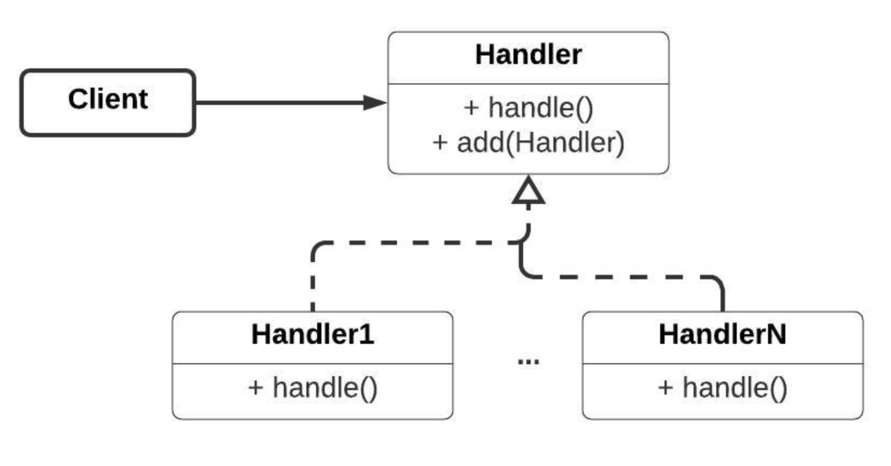

В случае, если мы желаем принимать решение об использовании в одном месте, а само действие – в другом, возникает понятие запроса.

Паттерн Цепочка обязанностей (Chain of responsibility) не требует связи запроса с конкретным объектом и требуемым методом и является абстрагированным, несущим в себе только данные запроса. Производится формирование обработчиков, которые будут знать, какой объект они должны обработать. Если обработчик не может совершить действие над запросом, он передаёт его следующему обработчику.

Сама цепочка обязанностей держит в себе обработчики и принимает запросы, далее осуществляя логику последовательной обработки.

P. S. Единая логика обработки. Отвязывает от конкретного объекта и его метода. Один запрос обрабатывается несколькими объектами.

Hedler определяет общий интерфейс и задает механизм передачи запроса, а каждый Hendler1..n содержат код обработки запросов

Преимущества паттерна:

Позволяет передавать запрос последовательно по цепочке обработчиков.
Каждый обработчик сам решает, передавать ли дальше запрос, что позволяет реализовать, например, множественные действия в ответ на запрос в зависимости от порядка обработчиков, также обработчик может модифицировать запрос, что позволяет составлять комплексную гибкую логику обработки запросов.
Уход от конкретного объекта, над которым необходимо выполнить действие
Недостатки паттерна:

Требуется реализация сущности, ответственной за принятие решений о создании, удалении и упорядочивании обработчиков в списке.
Варианты реализации и случаи применения:
Хранение следующего обработчика в самом обработчике
В данном варианте реализации в цепочку обработчиков может быть добавлен следующий, при чём каждый обработчик хранит указатель на следующий.

Этот подход может быть использован в случае, если не требуется особого порядка обработки сообщений и достаточно того, чтобы один обработчик принял запрос. Код представлен на листинге 6.

Внешний контроль над цепочкой обработчиков
При данной реализации необходимо создание некоторой контейнерной сущности, которая будет определять порядок обработчиков в цепочке и осуществлять проброс запроса по ней.

Это может быть полезно в том случае, если требуется гибко управляемая логика управления порядком обработки запроса, предоставляющая возможность по их упорядочиванию и контролю выполнения методов обработки сообщения.

