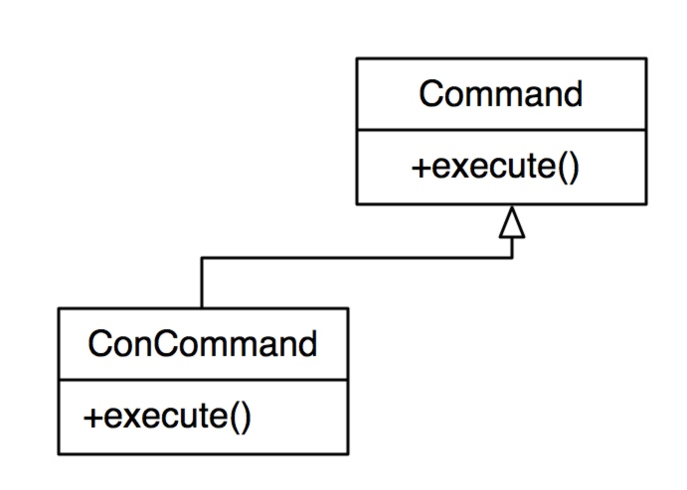

В случае, если мы желаем принимать решение об использовании в одном месте, а само действие – в другом, возникает понятие запроса.

Паттерн Команда (Command) решает проблему исполнения запроса в случае, если мы четко знаем, что надо сделать и какой объект это может выполнить.

Паттерн имеет один основной метод – execute. Паттерн несёт указатель, либо другой идентификатор объекта, а также указывает на то, какое действие с какими параметрами должно быть выполнено с объектом.

Запрос, или команда, идет в виде объекта. Базовый класс - и у нас может быть не одна команда, а несколько, в зависимости от того, что нам нужно. Команда может нести данные, может нести что надо сделать, (указатель на метод какого-либо объекта, например.)

Преимущества паттерна:

- Унификация обработки событий или запросов к системе.
- Уменьшается связанность между классами.
- Возможно управление выполнением команды, например,о постановка команд в очередь с приоритетом.
- Возможность комбинирования с другими паттернами, например с композитом – возможно формирование сложных команд, состоящих из других команд. 
  
Недостатки паттерна:

- Требуется изначально знать, кто может обработать команду и какое конкретное действие должно быть совершено.
- Проблема возникает в случае, если необходимо, чтобы команда была обработана несколькими объектами.