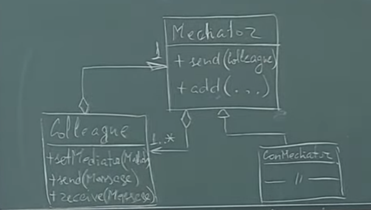
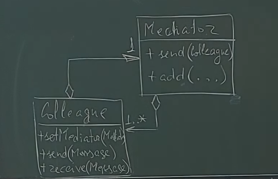

Паттерн Посредник (Mediator) решает проблемы, присущие предыдущему паттерну. Идея заключается в вынесении связей между подписчиками и издателями в отдельный объект – посредник. Чтобы не каждый объект держал список, кто на него подписался. Мы создаем логику, кому нужно сообщение, кому нет.

Связи вынести в отдельный объект, тогда каждый объект будет обращаться к этому отдельному объекту, а он в свою очередь будет искать нужные связи (с кем ему связаться). Позволяет уменьшить количество связей между объектами благодаря перемещению связей в него, в посредник. Так как посредник должен работать со всеми объектами, то он содержит указатели на все эти объекты.

Преимущества:

- Устранение прямых зависимостей между подписчиком и издателем.
- Централизованное взаимодействие – имеем контроль над ним.
- Упрощаются объекты за счёт выноса из них связей – разделений ролей.
- Выделение объекта-посредника позволяет задавать дополнительную логику оповещения.
Недостатки:

- Разрастается иерархия – требуется реализации родственности для не связанных классов (проблема отсутствия понятия интерфейса в C++).
- Дополнительный уровень косвенности при использовании посредников замедляет выполнение программы.

Объекту-посреднику требуются два метода – add для добавления связей, и send – для отправки оповещения. Сам объект должен содержать метод для установки посредника setMediator, метод для отправки сообщения send и метод для обработки сообщения receive.

Проблема кольца решается за счет того, что объект может держать shared_ptr, а медиатор – weak_ptr. Вся логика связи выносится в посредник, что позволяет разгрузить издатели, т.к. им тогда не требуется держать список, только указатель на посредника.

