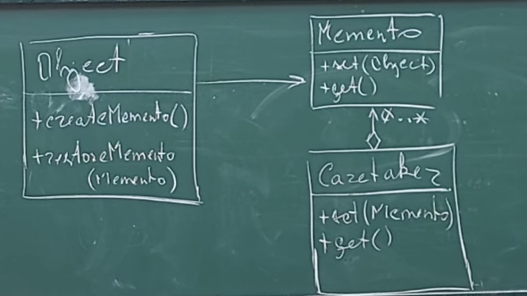

Часто возможны ситуации, в которых необходимо производить отмену некоторых действий (например откат изменений файла), т.е. необходима возможность возврата к предыдущему состоянию.

Паттерн Опекун (Memento) реализует идею вынесения логики сохранения состояний в отдельный объект, ответственный за сохранение состояний объекта и возвращение его в предыдущее состояние.

Memento - снимок объекта в какой-то момент времени. Опекун отвечает за хранение этих снимков и по возможности вернуться к предыдущему состоянию объекта.

Преимущества паттерна:

- Позволяет снять с класса задачу о сохранении своих предыдущих состояний.
- Предоставляет возможность откатывать состояние класса на несколько состояний назад.
- Позволяет реализовать различную логику сохранения состояний.

Недостатки паттерна:

- Требуется управлять опекуном.
- Требуется реализация механизма очистки и определения того, нужны снимки или нет.
- Затраты памяти на сохранение снимков состояний.

В объект необходимо добавить метод createMemento для сохранения состояния и метод restoreMemento для восстановления состояния по снимку.

Класс опекуна должен представлять собой контейнер для снимков состояний объекта, должен позволять устанавливать состояния, получать состояние, а также производить возврат состояния. Возможны различные способы хранения состояний – в виде стека, дерева, изменений относительно предыдущего состояния.

Класс снимка должен иметь методы set и get для сохранения и установления состояния.

