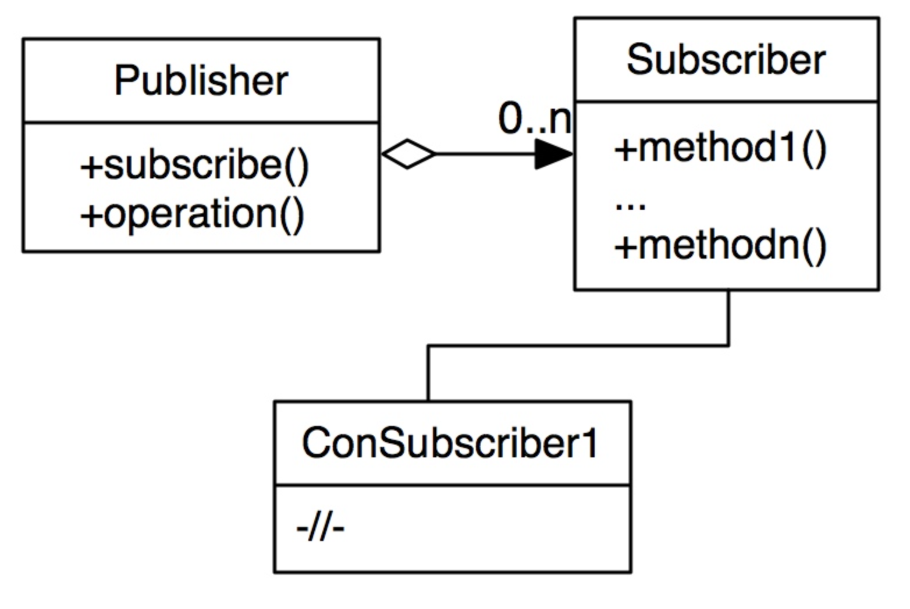

Паттерн Подписчик-издатель (Publisher-subscriber) решает проблему реагирования на какие-либо события, либо изменений объекта. Это достигается за счёт того, что объект, с которым происходят изменения, сообщает об этом другим – тем, кто “подписан” на данные изменения.

Группа объектов реагирует на один объект, на его изменения, издатель оповещает всех подписчиков, когда происхсодят изменения, вызывая их методы

Преимущества паттерна:

Издатели не зависят от подписчиков и всегда могут отправлять запросы.
Можно динамически подписываться и отписываться от издателей.
Недостатки паттерна:

Каждый издатель должен держать список своих подписчиков и методов, которые должны вызываться.
Нет порядка в оповещении подписчиков.
Если подписчики тоже могут быть издателями, возможны утечки памяти из-за удержания shared_ptr на подписчиков, либо бесконечные циклы при обработке события.
Варианты реализации и случаи применения:
В различных языках существуют разные реализации данного паттерна, отличающиеся одним важным моментом – зависит ли время жизни подписчика от времени жизни издателя. Это верно, например, в языке C# и библиотеке Qt. В C++ можно различными путями подойти к этому вопросу при помощи использования shared_ptr или weak_ptr, что зависит от решаемой задачи. В случае реализации с удержанием объекта, необходимо отписываться от события, когда оно более не необходимо.

Удержание подписчиков по weak_ptr. Данный подход применяется, если источник.
Удержание подписчиков по shared_ptr. Данный подход применим, например, при реализации подсистем программы, где мы обеспечиваем существование всех компонентов подсистемы, подписавшихся на события.
Универсальный шаблонный класс издателя, поддерживающий работу с weak_ptr и shared_ptr.

