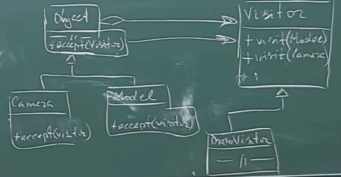

Следующая проблема - связанная с изменением интерфейса объектов. Если мы используем полиморфзим, мы не можем в производном кассе ни сузить, ни расширить интерфейс, так как он должен четко поддерживать интерфейс базового класса. Если нам необходимо расширить интерфейс, можно использовать паттерн Визитёр. Он позволяет во время выполнения (в отличие от паттерна Адаптера, который решает эту проблему до выполнения) подменить или расширить функционал.

Визитёр один функционал собирает в одно место для разных классов. Для каждого такого класса/подкласса есть свой метод, который принимает элемент этого подкласса. Конкретный визитёр уже реализует этот функционал.

Преимущества паттерна:

- Объединение разных иерархий в одну (проблема стратегии)
- Значительное упрощение схемы использования
- Отсутствие оберточных функций (проблема адаптера)
Недостатки паттерна:

- Расширение иерархии, добавление новых классов приводит к необходимости модификации посетителей.
- Проблема связи на уровне базовых классов.
- При изменении иерархии посетитель не сработает.
- Необходимость установления дружественных связей для обеспечения доступа к реализации.

