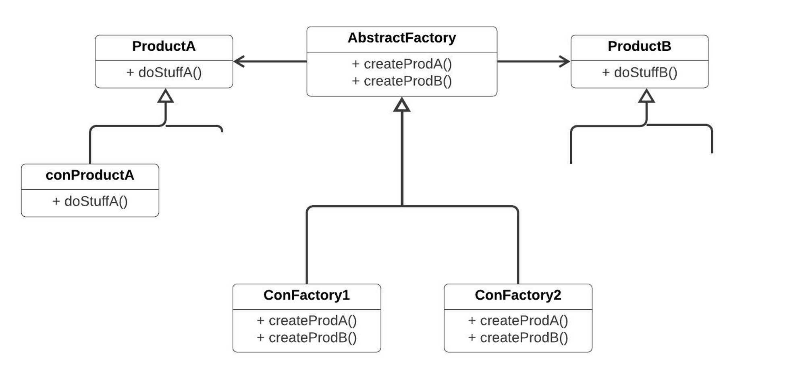

# Абстрактная фабрика

Абстрактная фабрика - развитие фабричного метода с добавлением функционала

Задача: создание "семейства" разных объектов, но связанных между собой
Можно "плодить" разные ветви Cretor'ов под каждый тип. продуктов, но мы теряем связь между этими продуктами.

Пример: в графических библиотеках: кисточка, ручка, сцена и т. п.

Каждая конкретная фабрика будет отвечать за создание определенного семейства объектов

Как и для фабричного метода, должен быть solution, который принимает решение, какую фабрику создавать

# По Тассову

Дает возможность сразу подменить одну группу создания объектов на другую.
Можно использовать фабричный метод, но теряется контроль, усложняется резко Solution

# Диаграмма

# Применимость:

- Когда бизнес-логика программы должна работать с разными видами связанных друг с другом продуктов, не завися от конкретных классов продуктов.

- Абстрактная фабрика скрывает от клиентского кода подробности того, как и какие конкретно объекты будут созданы. Но при этом клиентский код может работать со всеми типами создаваемых продуктов, поскольку их общий интерфейс был заранее определён.

- Когда в программе уже используется Фабричный метод, но очередные изменения предполагают введение новых типов продуктов.

- В хорошей программе каждый класс отвечает только за одну вещь. Если класс имеет слишком много фабричных методов, они способны затуманить его основную функцию. Поэтому имеет смысл вынести всю логику создания продуктов в отдельную иерархию классов, применив абстрактную фабрику.

### Преимущества
1. Гарантирует сочетаемость создаваемых продуктов.
2. Избавляет клиентский код от привязки к конкретным классам продуктов.
3. Выделяет код производства продуктов в одно место, упрощая поддержку кода.
4. Упрощает добавление новых продуктов в программу.
5. Реализует принцип открытости/закрытости.  

### Недостатки
1. Усложняет код программы из-за введения множества дополнительных классов.
2. Требует наличия всех типов продуктов в каждой вариации.

# Преимущества по Тассову

- создание в коде конкретных объектов
- четко отделяем принятие решения о создании объекта от создания самого объекта. Выделяется целая сущность, которая принимает решение, какой объект создавать.
- во время выполнения программы решать какой объект создавать.
- во время выполнения программы мо можем подменять один объект на другой.
- повторное использование одних и тех же объектов.
- не нужно контролировать создание объектов из разных семейств

# Недостатки по Тассову

- у абстрактной фабрики должен быть базовый интерфейс, если у библиотек используются различные понятия, то выделить базовое для всех не всегда возможно.
- не дает возможности одновременно создавать объекты из разных семейств(только из одного семейства).
- когда объединяем в один класс разные creator возникает необходимость, чтобы в разных иерархиях были подобные сущности для разных ситуаций.

# Связи с другими паттернами 

- Многие архитектуры начинаются с применения Фабричного метода (более простого и расширяемого через подклассы) и эволюционируют в сторону Абстрактной фабрики, Прототипа или Строителя (более гибких, но и более сложных).

- Строитель концентрируется на построении сложных объектов шаг за шагом. Абстрактная фабрика специализируется на создании семейств связанных продуктов. Строитель возвращает продукт только после выполнения всех шагов, а Абстрактная фабрика возвращает продукт сразу же.

- Классы Абстрактной фабрики чаще всего реализуются с помощью Фабричного метода, хотя они могут быть построены и на основе Прототипа.

- Абстрактная фабрика может быть использована вместо Фасада для того, чтобы скрыть платформо-зависимые классы.

- Абстрактная фабрика может работать совместно с Мостом. Это особенно полезно, если у вас есть абстракции, которые могут работать только с некоторыми из реализаций. В этом случае фабрика будет определять типы создаваемых абстракций и реализаций.

- Абстрактная фабрика, Строитель и Прототип могут быть реализованы при помощи Одиночки.