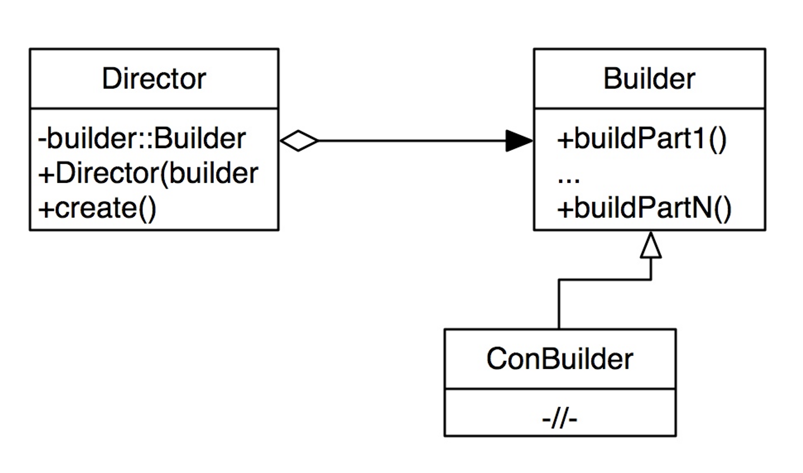

**Проблема:** 
сложные объекты создаются поэтапно, иногда - этапы создания разнесены в разных частях программы.

**Идея решения:** 
вынести в отдельный код этапы создания сложных объектов.

- Строитель - класс, который включает в себя этапы создания сложного объекта.
- Кроме того, выделяем еще один класс, который контролирует создание - Директор.
- Строитель - создает объект.
- Директор - подготавливает данные для создания, контролирует этапы создания, отдает объект клиенту.

**Диаграмма (должен быть ещё производный директор ConDirector):**

Как и для фабричного метода, должен быть solution, который принимает решение, какого директора создавать
- Когда надо использовать?
    1. Для поэтапного создания сложных объектов
    2. Когда создание объекта разнесено в коде, объект создается не сразу (например, данные подготавливаются поэтапно)
- Преимущество: 
  1. Вынесение создания и контроля в отдельные классы
  2. изолирует сложный код сборки продукта от его основной бизнес-логики.
  3. Позволяет использовать один и тот же код для создания различных продуктов.
- Недостатки:
  1. Усложняет код программы из-за введения дополнительных классов. 
- Проблема: с данными - конкретные строители базируются на одних и тех же входных данных и количество этапов строительства не меняется ⇒ возникнут проблемы при подмене одного строителя на другой).
- Решение: сделать агрегацию не на уровне базовых классов, а на уровне производных. Тогда можно будет менять интерфейс базового билдера (в том числе расширять или сужать), и конкретный директор будет работать с конкретным билдером не как с базовым классом, а как с производным.

# Отношения с другими паттернами
- Многие архитектуры начинаются с применения Фабричного метода (более простого и расширяемого через подклассы) и эволюционируют в сторону Абстрактной фабрики, Прототипа или Строителя (более гибких, но и более сложных).

- Строитель концентрируется на построении сложных объектов шаг за шагом. Абстрактная фабрика специализируется на создании семейств связанных продуктов. Строитель возвращает продукт только после выполнения всех шагов, а Абстрактная фабрика возвращает продукт сразу же.

- Строитель позволяет пошагово сооружать дерево Компоновщика.

- Паттерн Строитель может быть построен в виде Моста: директор будет играть роль абстракции, а строители — реализации.

- Абстрактная фабрика, Строитель и Прототип могут быть реализованы при помощи Одиночки.

# По Тассову

Позволяет создавать объекты поэтапно.

Также нужен отдельный класс для контролирования создания сложного объекта.

Builder создает объект, Director контролирует создание (подготавливает данные для создания и отдает объект) - разделение ответственности.

Когда надо использовать? Для поэтапного создания сложных объектов. Когда создание объекта разнесено в коде, объект создается не сразу (например, данные подготавливаются поэтапно).

Преимущества:

- За контроль и создание отвечают разные сущности.
- Позволяет использовать код для создания различных продуктов.
- Пошаговое создание продукта.
- Возможность менять количество этапов создания продукта(введение нового Директора).
Недостатки:

- усложнение программы из-за введения новых классов