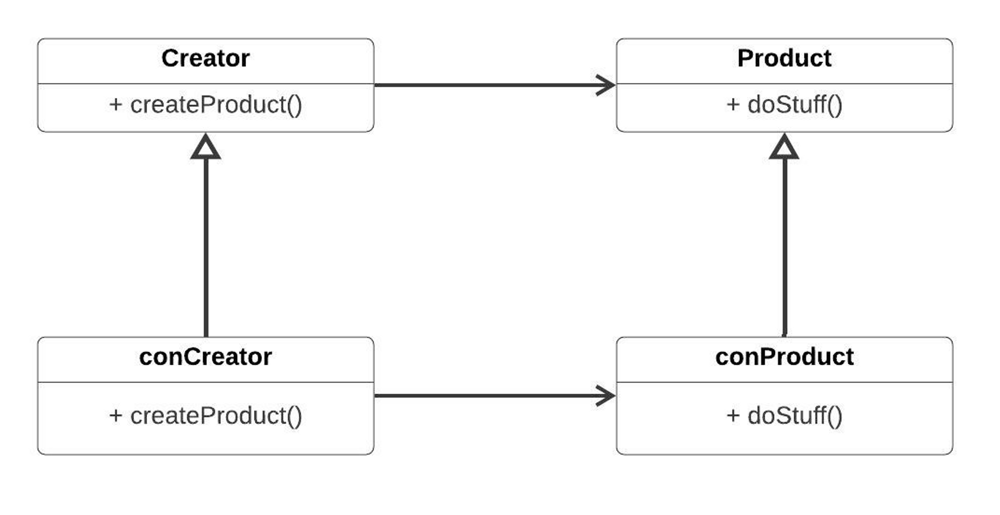
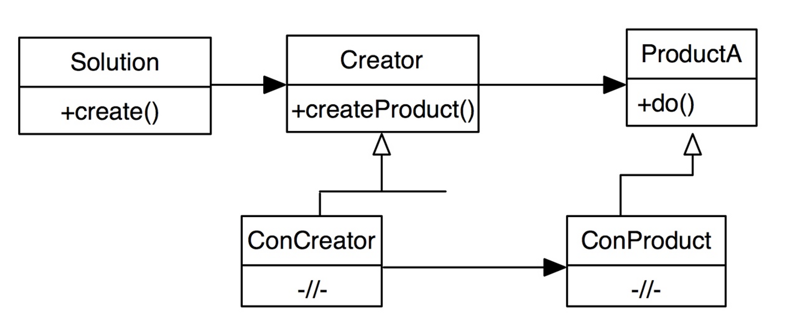

# Паттерн фабричный метод

Основная идея заключается в том, чтобы избавиться от явного создания объектов. 
Эти будут заниматься «креаторы». При этом то, какой конкретно объект будет создан, 
т.е. то, какой креатор использовать будет говорить нам особенная таблица.
Иными словами, будет выделяться отдельная сущность, которая будет принимать решение о том, какой объект создавать.

Это дает возможность выбирать объект, который создавать, во время выполнения программы. 
Так же, во время выполнения программы, мы можем подменять создание одного объекта, на создание другого.

## Идея

Разнести на две задачи:

1. Принятие решения, какой объект создавать.
2. Создание объекта, причем при создании объекта нужно "отвязаться" от конкретного типа.

Мы будем создавать специальные объекты, которые отвечают за порождение других объектов.

Диаграмма

## Использование

Когда нам нужно использовать фабричный метод:

1. Основная задача: подмена одного объекта на другой.
2. Когда принятие решение в одном месте кода, создание - в другом.

### Преимущества

- Облегчается добавление новых классов, избавляем методы от привязки к конкретным классам.
- Код очищается от `new`, используя полиморфизм по полной (создаём новые классы, не изменяя уже написанный код)
- Паттерн работает во всех языках
- Позволяет разнести в коде принятие решения о создании объекта (solution) и само создание (creator)
- Решение о том, какой объект создавать, принимается во время выполнения, тогда же можно менять это решение
- во время выполнения программы мы можем подменять один объект на другой.
- повторное использование одних и тех же объектов.

### Недостатки
- Много кода => разрастается .exe
- Резко растет время выполнения
- можно сделать на шаблонах, но после одного изменения будет все перекомпилировано и принятие решения какой
объект создавать перейдет на этап компиляции

# Solution
Принятие решения о том, кто будет создавать объект, мы выносим. Класс, принимающий решение, объект не создает. Он создает объект для его создания.

Solution предоставляет метод для регистрации creator-ов.

На основе чего Solution может принять решение, какой класс создавать? Solution должен быть независим от реализации, от конкретного набора классов - следовательно, **мы не можем использовать switch-case.**

# Идея решения

создаем карту продуктов, которые у нас существуют. При добавлении нового класса, регистрируем его в этой карте. 
Используя эту карту, осуществляем выбор. **Solution предоставляет метод для регистрации креаторов классов (в этой карте).**

# Отношения с другими паттернами
- Многие архитектуры начинаются с применения Фабричного метода (более простого и расширяемого через подклассы) и эволюционируют в сторону Абстрактной фабрики, Прототипа или Строителя (более гибких, но и более сложных).

- Классы Абстрактной фабрики чаще всего реализуются с помощью Фабричного метода, хотя они могут быть построены и на основе Прототипа.

- Фабричный метод можно использовать вместе с Итератором, чтобы подклассы коллекций могли создавать подходящие им итераторы.

- Прототип не опирается на наследование, но ему нужна сложная операция инициализации. Фабричный метод, наоборот, построен на наследовании, но не требует сложной инициализации.

- Фабричный метод можно рассматривать как частный случай Шаблонного метода. Кроме того, Фабричный метод нередко бывает частью большого класса с Шаблонными методами.