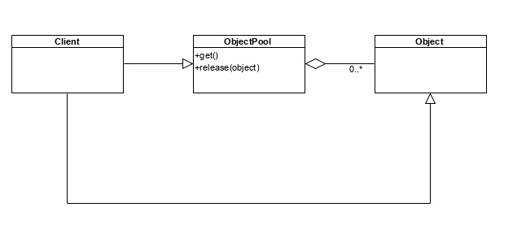

# Пул объектов
Пул объектов предоставляет набор готовых объектов, которые мы можем использовать

## Пример использования
Многопроцессорная система. Количество заданий, которое мы должны создать, должно быть не больше количества процессоров.
Чтобы каждый процессор выполнял свою задачу.

## Когда надо использовать?
Когда создание или уничтожение какого-либо объекта - трудоемкий процесс и надо "держать" определенное количество объектов в системе.

## Задачи
- Он держит эти объекты.
- Может их создавать (то есть может расширяться).
- По запросу отдает объект.
- Если клиенту этот объект не нужен, он может его вернуть в пул.
- Исходя из пунктов 3 и 4, для каждого включенного объекта в пул мы должны установить, используется он или не используется.

## Диаграмма
Диаграмма крайне простая:

## Минусы
После использования объекта мы возвращаем его в пул, и здесь возможна так называемая утечка информации. 
Мы работали с этим объектом. Вернув его в пул, он нах нах нахо находится в том состоянии, с которым мы с ним перед этим работали. 
Его надо либо вернуть в исходное состояние, либо очистить, чтобы при отдаче этого объекта другому клиенту не произошла утечка информации.

## Пару комментариев
Пулл объектов - контейнерный класс, удобно использовать итераторы!

Необходимо знать, занят объект или нет, используем пару: ключ (bool) и объект.

# По Тассову

Пул объектов предоставляет набор готовых объектов, которые мы можем использовать

## Пример использования
Многопроцессорная система. Количество заданий, которое мы должны создать, должно быть не больше количества процессоров. Чтобы каждый процессор выполнял свою задачу.

## Когда надо использовать?
Когда создание или уничтожение какого-либо объекта - трудоемкий процесс и надо "держать" определенное количество объектов в системе.

Если нам необходим, возможно ограниченный, набор определенных объектов. При запросе объекта мы даем его из этого набора, после использования возвращаем назад, при этом вернув в исходное состояние.

Используется, когда создание или уничтожение какого-либо объекта - трудоемкий процесс и надо "держать" определенное количество объектов в системе.

## Задачи:
- Он держит эти объекты.
- Может их создавать (то есть может расширяться).
- По запросу отдает объект.
- Если клиенту этот объект не нужен, он может его вернуть в пул.
- Исходя из пунктов 3 и 4, для каждого включенного объекта в пул мы должны установить, используется он или не используется. Клиент может принимать объект и возвращать его в пул объектов.
## Преимущества:

- улучшает производительность, так как объекты не создаются и не уничтожаются
## Недостатки:

- после использования объектов мы возвращаем его в пул, здесь возможна утечка информации. Объект также необходимо вернуть в исходное состояние.