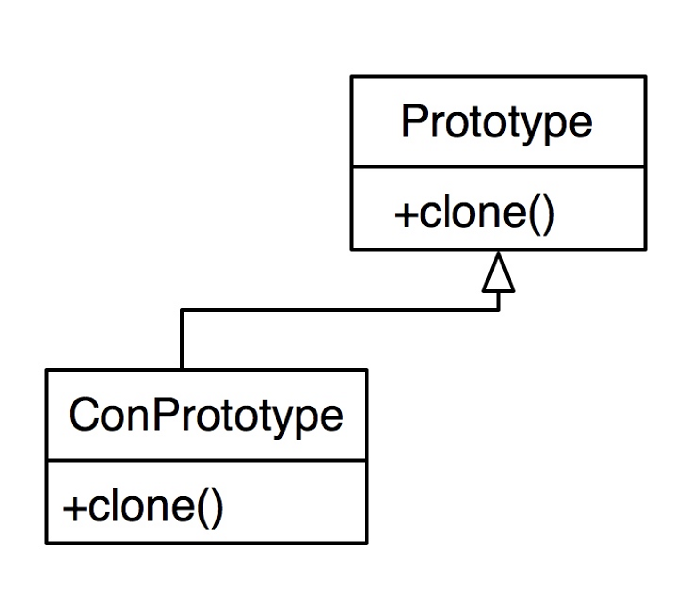

# Прототип

Идея: создать подобный объект или копию объекта, не зная класса объекта.

- **Проблема:** Хотим создать копию объекта, не зная его класса. (Например, в подменяемом методе). Также мы не хотим тащить за ним его Creator’ы.
- **Решение:** Добавляем в базовый класс метод clone(), который создаст новый объект на основе существующего. Производные классы реализуют clone() под себя.

# По Тассову

Позволяет создавать объекты на основе других, не вызывая creator.

Мы добавляем в базовый класс метод clone(), возвращающий указатель на себя, производные классы реализуют clone() под себя, возвращая указатель на подобный объект.

Преимущества:

- Ускоряет создание объектов
- Позволяет клонировать объекты, не привязывая их к конкретным классам
Недостатки:

- тяжело клонировать составные объекты, имеющие ссылки на другие объекты, а так же объекты, которые во внутреннем представлении имеют другие объекты

Диаграмма:

Преимущества:
- Позволяет клонировать объекты, не привязываясь к их конкретным классам.
- Меньше повторяющегося кода инициализации объектов.
- Ускоряет создание объектов.
- Альтернатива созданию подклассов для конструирования сложных объектов.

Недостатки:
- Сложно клонировать составные объекты, имеющие ссылки на другие объекты.

Использование:
- Когда ваш код не должен зависеть от классов копируемых объектов.
- Такое часто бывает, если ваш код работает с объектами, поданными извне через какой-то общий интерфейс. Вы не можете привязаться к их классам, даже если бы хотели, поскольку их конкретные классы неизвестны.
Паттерн прототип предоставляет клиенту общий интерфейс для работы со всеми прототипами. Клиенту не нужно зависеть от всех классов копируемых объектов, а только от интерфейса клонирования.
- Когда вы имеете уйму подклассов, которые отличаются начальными значениями полей. Кто-то мог создать все эти классы, чтобы иметь возможность легко порождать объекты с определённой конфигурацией.
- Паттерн прототип предлагает использовать набор прототипов, вместо создания подклассов для описания популярных конфигураций объектов.

# Отношения с другими паттернами
- Многие архитектуры начинаются с применения Фабричного метода (более простого и расширяемого через подклассы) и эволюционируют в сторону Абстрактной фабрики, Прототипа или Строителя (более гибких, но и более сложных).

- Классы Абстрактной фабрики чаще всего реализуются с помощью Фабричного метода, хотя они могут быть построены и на основе Прототипа.

- Если Команду нужно копировать перед вставкой в историю выполненных команд, вам может помочь Прототип.

- Архитектура, построенная на Компоновщиках и Декораторах, часто может быть улучшена за счёт внедрения Прототипа. Он позволяет клонировать сложные структуры объектов, а не собирать их заново.

- Прототип не опирается на наследование, но ему нужна сложная операция инициализации. Фабричный метод, наоборот, построен на наследовании, но не требует сложной инициализации.

- Снимок иногда можно заменить Прототипом, если объект, состояние которого требуется сохранять в истории, довольно простой, не имеет активных ссылок на внешние ресурсы либо их можно легко восстановить.

- Абстрактная фабрика, Строитель и Прототип могут быть реализованы при помощи Одиночки.