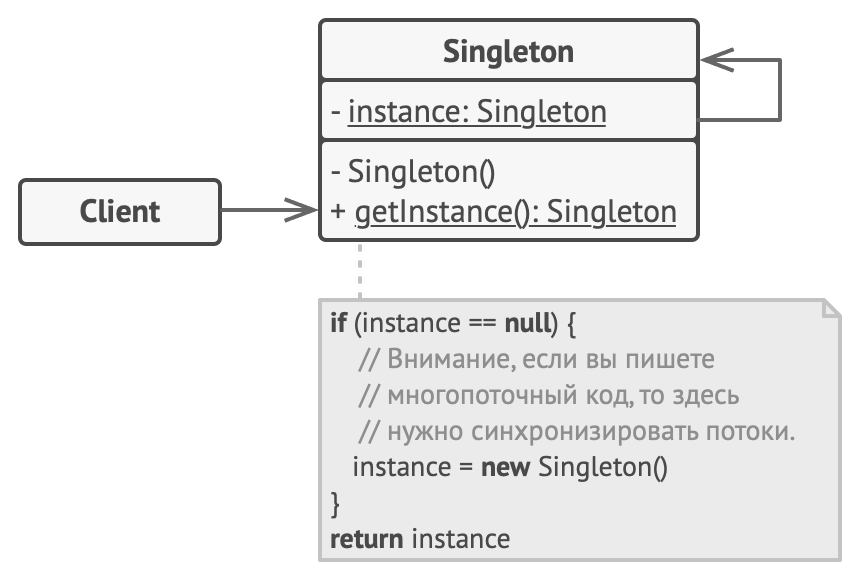

# Одиночка

Возникают задачи, в которых должно быть гарантировано, что создан только один объект класса.

**Решение:**убрать конструкторы из public части. В паблик части сделать статический метод, который будет при необходимости порождать объект. В статическом методе содержится статический член класса своего объекта. Поскольку он статический – будет создан только один раз. Конструктор находится в private части. Нельзя копировать – запрещаем конструктор копирования и оператор присваивания.

**Недостатки метода:**

- Глобальный объект: доступ через глобальный интерфейс, вызовом статического метода
- Проблема шаблона: лишаемся подмены. Решение о том, какой объект создавать, принимается на этапе компиляции. Шаблоны здесь лучше не использовать.
- Нарушает принцип единственной ответственности класса.
- Проблемы мультипоточности.
- Маскирует плохой дизайн.

**Альтернатива**:

- фабричный метод.

Диаграмма:

# По Тассову

Подойдет, если нам необходимо иметь во всей системе объект только в единственном экземпляре.

Преимущества:

гарантирует наличие единственного экземпляра класса
предоставляет доступ из любой части программы
Недостатки:

анти-паттерн, так как представляет собой глобальный объект.
не можем принимать решение о том, какой объект создавать при работе программы. Выполняется на этапе компиляции.
Альтернатива: фабричный метод, который создает объект только один раз.

# Отношения с другими паттернами
- Фасад можно сделать Одиночкой, так как обычно нужен только один объект-фасад.

- Паттерн Легковес может напоминать Одиночку, если для конкретной задачи у вас получилось свести количество объектов к одному. Но помните, что между паттернами есть два кардинальных отличия:

- В отличие от Одиночки, вы можете иметь множество объектов-легковесов.
- Объекты-легковесы должны быть неизменяемыми, тогда как объект-одиночка допускает изменение своего состояния.
- Абстрактная фабрика, Строитель и Прототип могут быть реализованы при помощи Одиночки.

