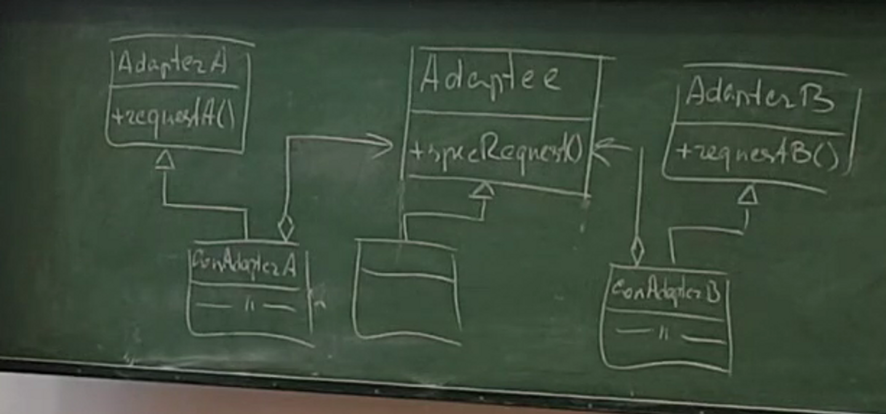

# Применимость
Паттерн можно часто встретить в C++ коде, особенно там, где требуется конвертация разных типов данных или совместная работа классов с разными интерфейсами.

# Признаки применения паттерна
Адаптер получает конвертируемый объект в конструкторе или через параметры своих методов. 
Методы Адаптера обычно совместимы с интерфейсом одного объекта. 
Они делегируют вызовы вложенному объекту, превратив перед этим параметры вызова в формат, поддерживаемый вложенным объектом.

#### Проблема
Представьте, что вы делаете приложение для торговли на бирже. Ваше приложение скачивает биржевые котировки из нескольких источников в XML, а затем рисует красивые графики.

В какой-то момент вы решаете улучшить приложение, применив стороннюю библиотеку аналитики. 
Но вот беда — библиотека поддерживает только формат данных JSON, несовместимый с вашим приложением.

#### Решение
Вы можете создать адаптер. Это объект-переводчик, который трансформирует интерфейс или данные одного объекта в такой вид, чтобы он стал понятен другому объекту.

При этом адаптер оборачивает один из объектов, так что другой объект даже не знает о наличии первого. 
Например, вы можете обернуть объект, работающий в метрах, адаптером, который бы конвертировал данные в футы.

Адаптеры могут не только переводить данные из одного формата в другой, но и помогать объектам с разными интерфейсами работать сообща. Это работает так:

1. Адаптер имеет интерфейс, который совместим с одним из объектов.
2. Поэтому этот объект может свободно вызывать методы адаптера.
3. Адаптер получает эти вызовы и перенаправляет их второму объекту, но уже в том формате и последовательности, которые понятны второму объекту.

Иногда возможно создать даже двухсторонний адаптер, который работал бы в обе стороны.

# По Тассову

У класса был один интерфейс. Мы этот интерфейс подменяем другим интерфейсом, 
чтобы в зависимости от ситуации использовать этот объект по-разному.

Основная идея - независимо изменять роли

### Использование
Адаптер надо применять в следующих ситуациях:

Один объект может выступать в нескольких ролях.
Нам нужно внедрить в систему сторонние классы, имеющие другой интерфейс.
Мы, используя полиморфизм, сформировали интерфейс для базового класса. 
Но, какие-то определенные сущности, определенные от базового класса, должны поддерживать 
еще какой то функционал. Мы не можем расширить этот функционал и изменять написанный код. 
Мы можем эту проблему решить добавлением функционала на основе того, что есть, за счет адаптера. 
Причем это можно сделать не для всей иерархии, а для определенного объекта определенного класса или группы классов.
У нас есть наш объект, и мы хотим подменить интерфейс этого объекта. Мы будем работать с этим объектом через объект другого класса. Таким образом, мы любой объект можем внедрить в любое место, поменяв его интерфейс.

Базовый класс - AdapterA, задача которого - подменить интерфейс. 
Базовый класс, который нам надо адаптировать - Adapter, его интерфейс надо подменить. 
Класс, который решает эту проблему - ConAdapterA. Он будет подменять интерфейс.

#### Преимущества:

- Позволяет не возлагать на один объект несколько ролей
- Разнесение ответственностей по классам
- Использование сторонних разработок, нестандартных
- Отделяет и скрывает от клиента подробности различных интерфейсов
- Позволяет адаптировать интерфейс к требуемому
- Позволяет независимо развивать различные ответственности сущности
- Расширение интерфейса можно отнести к адаптеру
#### Недостатки:

- Нужно создавать много классов, что увеличивает время и память
- Один класс может поддерживать несколько интерфейсов, они могут пересекаться. Дублирование кода.
-Часто адаптер должен иметь доступ к реализации класса.
