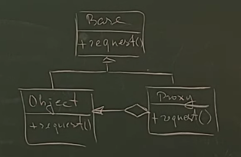

Заместитель (или Proxy) позволяет нам работать не с реальным объектом, а с другим объектом, который подменяет реальный. 
В каких целях это можно делать?

1. Подменяющий объект может контролировать другой объект, задавать правила доступа к этому объекту. Например, у нас есть разные категории пользователей. В зависимости от того, какая у пользователя категория категория, определять, давать доступ к самому объекту или не давать. Это как защита.

2. Так как запросы проходят через заместителя, он может контролировать запросы, заниматься статистической обработкой: считать количество запросов, какие запросы были и так далее.

3. Разгрузка объекта с точки зрения запросов. Дело в том, что реальные объекты какие-то операции могут выполнять крайне долго, например, обращение "поиск в базе чего-либо" или "обращение по сети куда-то". Это выполняется долго. Proxy может сохранять предыдущий ответ и при следующем обращении смотреть, был ответ на этот запрос или не был. Если ответ на этот вопрос был, он не обращается к самому хозяину, он заменяет его тем ответом, который был ранее. Естественно, если состояние объекта изменилось, Proxy должен сбросить ту историю, которую он накопил.

Базовый класс Subject, реальный объект RealObject и объект Proxy, который содержит ссылку на объект, который он замещает. Когда мы работаем через указатель на базовый объект Subject, мы даже не можем понять, с кем мы реально работаем: с непосредственно объектом RealSubject или с его заместителем Proxy. А заместитель может выполнять те задачи, которые мы на него возложили.

Если состояние RealObject изменилось, Прокси должен сбросить историю, которую он накопил.

Преимущества:

- Возможность контролировать какой-либо объект незаметно от клиента.
- Proxy может работать, когда объекта нет. Например, мы запросили объект, может быть объект был, но ответ для Proxy устарел, этого объекта нет. Proxy может вернуть нам этот ответ, указав, что он устаревший.
- Proxy может отвечать за жизненный цикл объекта. Он его может создавать и удалять.
Недостатки:

- Может увеличиться время доступа к объекту (так как идет дополнительная обработка через Proxy).
- Proxy должен хранить историю обращений, если такая задача стоит. Это влияет на память, она расходуется на хранение запросов и ответов на них.

# Связь с другими паттернами

- Адаптер предоставляет классу альтернативный интерфейс. Декоратор предоставляет расширенный интерфейс. Заместитель предоставляет тот же интерфейс.

- Фасад похож на Заместитель тем, что замещает сложную подсистему и может сам её инициализировать. Но в отличие от Фасада, Заместитель имеет тот же интерфейс, что его служебный объект, благодаря чему их можно взаимозаменять.

- Декоратор и Заместитель имеют схожие структуры, но разные назначения. Они похожи тем, что оба построены на принципе композиции и делегируют работу другим объектам. Паттерны отличаются тем, что Заместитель сам управляет жизнью сервисного объекта, а обёртывание Декораторов контролируется клиенто